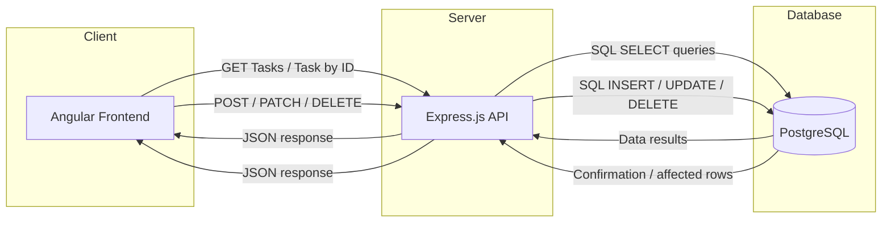
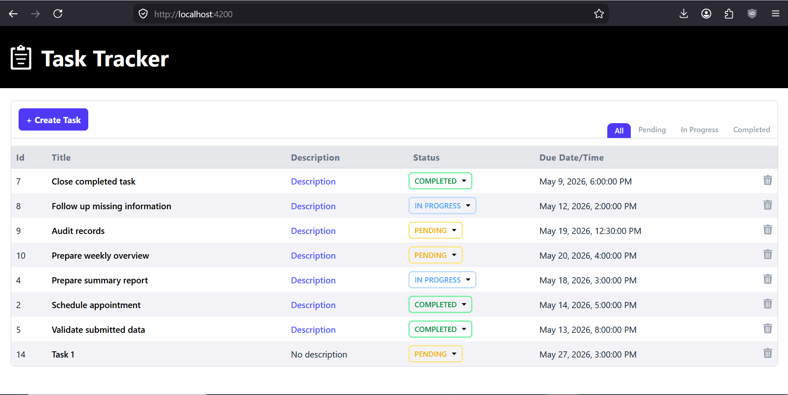
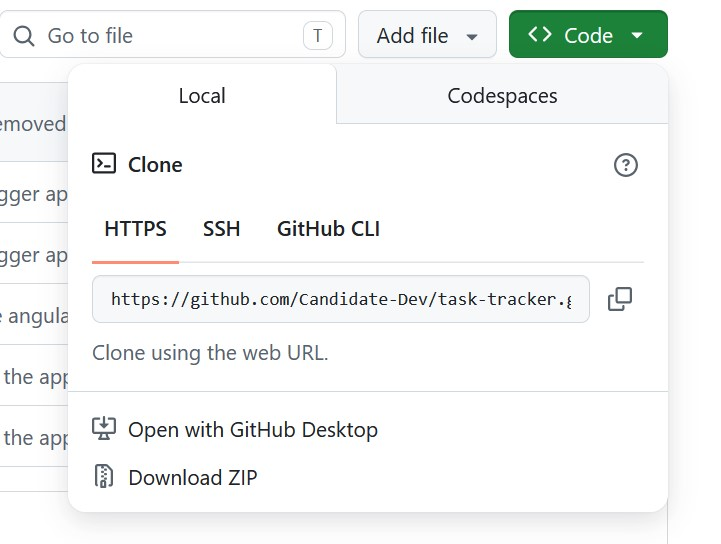

# Task Traker Application

## A full-stack task tracker web application that allows caseworkers to manage their tasks from a user-friendly interface!

## Overview

This application is a full-stack task management system that allows users to efficiently create, manage and track their tasks through a simple and user-friendly interface.

The project consists of an Angular frontend, an Express.js REST API backend and a PostgreSQL database, all running in a fully dockerized environment using Docker Compose for easy setup and development.

Features include:

- Create tasks
- View all tasks
- Update task status
- Delete tasks
- REST API backend
- PostgreSQL persistence
- Dockerized setup
- Seeded demo data
- Unit tests with Vitest
- Swagger API documentation
- Validation and error handling

## Tech Stack

### Frontend
- Angular
- TypeScript

### Backend
- Express.js
- Node.js

### Database
- PostgreSQL

### Tooling
- Docker
- Docker Compose
- Vitest
- Swagger

## Architecture


## Preview


## How to install and run the application
- clone the project or download the zip on your machine
    * clone the project in the terminal from selected folder:
        ```
        git clone https://github.com/Candidate-Dev/task-tracker.git
        ```
    * alternatively download the zip file from github repository
        
        

- navigate on your machine into the root of the project directory in the terminal and run:
    ```
    docker compose up --build -d
    ```

    * This command will:
        - build the image and start the frontend container
        - build the image and start the backend container
        - build the image and start the PostgreSQL container
        - seed the database with demo data

        
- acces the application in the browser:
    * frontend: `http://localhost:4200`
    * backend: `http://localhost:3000`
    * api-documentation: `http://localhost:3000/api-docs`

> [!IMPORTANT]
> Make sure the ports 4200, 3000 and 5432 are free for the application to be able to run correctly

- to run unit-tests with vitest from project root directory run:
    ```
    docker compose exec backend npm test
    ```